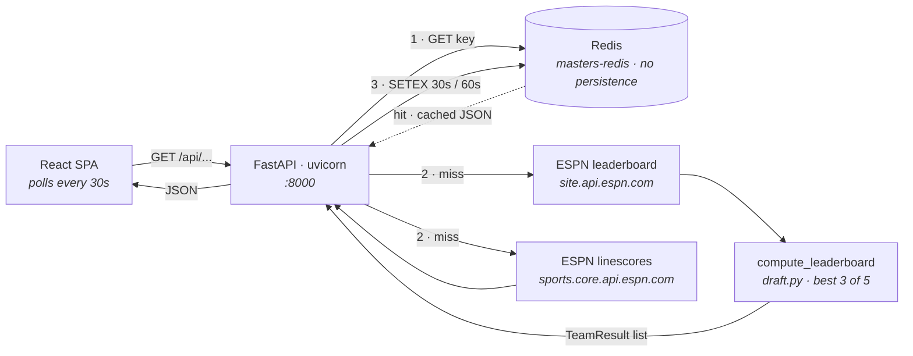

# masters-league

> Fantasy golf dashboard for the Masters — ten teams of five golfers, scored best-3-of-5 against
> live ESPN data.

[](https://github.com/vollminlab/masters-league/actions/workflows/build.yml)


A private pool runs a Masters draft every April; this turns it into a live leaderboard. The backend
pulls the PGA leaderboard from ESPN's public API, folds each team's five picks down to a counting
score, and serves a single-page React dashboard that refreshes itself every 30 seconds during play.

Two design decisions shape everything else. The **draft is source code** — `backend/draft.py` is a
Python dict literal, not a database table, so changing a pick means editing the file and shipping a
new image. And there is **no background poller**: ESPN is only ever contacted on a cache miss, so
the request rate against ESPN is bounded by the Redis TTL rather than by the number of viewers.

The repository is seasonal. It runs during Masters week and sits idle the rest of the year; the
current release is `v1.1.1`, cut for the 2026 tournament.

Deployed at <https://mastersleague.vollminlab.com>.

---

## Architecture



Both cache paths are **best-effort**. Every Redis `get` and `setex` is wrapped in
`try/except Exception` that logs a warning and continues, so a dead Redis degrades the app to
"fetch ESPN on every request" rather than taking it down. The same is true upstream: if
`fetch_players()` raises, `_build_payload` substitutes an empty player dict, every golfer falls back
to a placeholder row, and the response is a valid — but empty — leaderboard rather than a 500. Note
that this empty result is *also* written to the cache, so an ESPN blip is visible for up to
`CACHE_TTL` seconds after it clears.

The container is a two-stage build: Node 22 builds the Vite bundle, and the Python image copies
`dist/` to `backend/static/`. One image, one process, one port.

---

## Scoring

### How a team is built

There is no draft UI and no persistence layer. `backend/draft.py` defines the entire league:

```python
DRAFT: dict[str, list[str]] = {
    "Brodie": ["Rory McIlroy", "Chris Gotterup", "Gary Woodland", "Max Homa", "Michael Kim"],
    ...
}
```

Ten entries, each mapping a team name to exactly five golfer names in pick order. Pick order is
recorded but never used by the scoring code — it exists only as documentation of the draft.

Golfers are matched to ESPN competitors by `normalize_name()`: lowercase, NFD-decompose, drop
combining marks, strip. That is what lets `"Ludvig Åberg"` in the draft file match ESPN's spelling.
A name that does not resolve is not an error — the golfer gets a placeholder row with
`score: null`, `score_display: "-"` and an empty `player_id`, which is also the normal state before
the tournament starts.

### How the counting score is computed

Per team, in `scoring._compute_team`:

1. **Classify.** A golfer is *active* if neither `is_cut` nor `is_withdrawn`. Cut/WD detection comes
   from ESPN's `status.type.name` and `status.type.description`, matching `CUT`, `WD`, `withdraw`
   or `did not`.
2. **Disqualify.** Fewer than 3 active golfers → the team is disqualified: `counting_score` is
   `null`, display is `"DQ"`, and it is excluded from ranking entirely.
3. **Pick the best three.** Sort the active golfers ascending by cumulative to-par `score` and take
   the first three. Those three are flagged `is_counting: true` and rendered with a gold dot.
4. **Sum.** `counting_score` is the plain sum of those three to-par values. Lower is better.

### Ranking and ties

Non-disqualified teams are sorted ascending by `counting_score`. Positions are assigned by index,
except that a team whose score equals the previous team's score inherits that team's position — so
positions go `1, 2, 2, 4`. **There is no tiebreaker.** Tied teams are genuinely tied, and the
frontend prefixes shared positions with `T` (`T2`).

Disqualified teams are appended after the ranked teams, sorted alphabetically by team name, with
`position: null`.

### Sharp edges in the algorithm

- **A missing score sorts as even par.** Both the best-three sort and the sentinel used for team
  ranking treat "no data" as a number: `g.score if g.score is not None else 0` in the sort,
  `9999` for a null team score. Before the first round this means every team shows `E` and every
  team is tied for first. Mid-tournament it means a golfer ESPN hasn't scored yet can displace a
  real under-par round out of the counting three.
- **`counting_score` sums only non-null scores** while the *selection* of the three counted nulls as
  zero, so a counted-but-unscored golfer contributes nothing rather than zero-and-a-slot. The two
  behaviours are consistent in effect but derived differently.
- **`is_counting` is back-mapped by normalized name**, not by identity, so the flag would light up
  on both rows if a team ever held two golfers whose names normalize identically.

---

## HTTP API

All responses are JSON. There is no authentication anywhere in the application.

| Method | Path | Purpose | Response |
|---|---|---|---|
| `GET` | `/api/health` | Liveness/readiness probe; also HAProxy's health check | `{"status": "ok"}` |
| `GET` | `/api/leaderboard` | Full computed leaderboard for all ten teams | `LeaderboardData` |
| `GET` | `/api/scorecard/{player_id}` | Hole-by-hole card for one ESPN competitor | `ScorecardData`, or `503 {"error": "Scorecard unavailable"}` if the upstream fetch fails |
| `GET` | `/{full_path:path}` | SPA catch-all — serves the file if it exists under `static/`, otherwise `index.html` | static asset |

The catch-all route is **only registered if `backend/static/` exists** at import time. That
directory is produced by the Docker build and is gitignored, so a locally-run backend has no SPA
route at all and returns 404 for anything outside `/api`.

### `LeaderboardData`

```json
{
  "teams": [
    {
      "name": "Serg",
      "counting_score": -14,
      "counting_score_display": "-14",
      "cut_count": 1,
      "active_count": 4,
      "disqualified": false,
      "position": 1,
      "golfers": [
        {
          "name": "Scottie Scheffler",
          "score": -7,
          "score_display": "-7",
          "position": "T2",
          "thru": "F",
          "is_cut": false,
          "is_withdrawn": false,
          "is_counting": true,
          "round_scores_display": ["-3", "-4"],
          "player_id": "9478"
        }
      ]
    }
  ],
  "last_updated": "2026-04-11T18:42:07.512+00:00",
  "cache_ttl": 30,
  "player_count": 89
}
```

`score_display` carries `"CUT"` or `"WD"` for eliminated golfers, `"-"` for an unmatched name, and
otherwise `"-7"` / `"E"` / `"+3"`. `thru` is `"F"` for a finished round, a hole count like `"9"`, or
ESPN's pre-formatted tee time such as `"2:50 PM ET"`. `last_updated` is stamped when the payload is
*built*, not when it is served — a cached response reports the age of the underlying ESPN fetch.

### `ScorecardData`

```json
{
  "player_id": "9478",
  "current_round": 2,
  "rounds": [
    {
      "round": 1,
      "started": true,
      "to_par_display": "-5",
      "out": 34,
      "in": 33,
      "total": 67,
      "holes": [{"hole": 1, "par": 4, "strokes": 4, "score_type": "PAR"}]
    }
  ]
}
```

All four rounds are always present; unplayed ones are stubs with `started: false` and `holes: []`.
`out`, `in` and `total` are `null` unless the corresponding nine is *complete* — nine non-null
stroke values. `score_type` is taken from ESPN when present and otherwise derived from
`strokes - par` via `_diff_to_type`, which covers `ALBATROSS` through `WORSE`.

---

## ESPN data sources

| Data | URL | Configurable |
|---|---|---|
| Leaderboard | `https://site.api.espn.com/apis/site/v2/sports/golf/leaderboard?league=pga` | `ESPN_URL` |
| Scorecard | `https://sports.core.api.espn.com/v2/sports/golf/leagues/pga/events/401811941/competitions/401811941/competitors/{player_id}/linescores` | **no** — hardcoded in `backend/scorecard.py` |

**The two sources disagree about which tournament it is.** The leaderboard endpoint has no event
filter — `fetch_players` simply takes `events[0]`, whatever PGA event ESPN lists first. The
scorecard endpoint is pinned to event `401811941`. During Masters week they agree; outside it, the
leaderboard tracks some other tournament while scorecards still resolve against the Masters. That
event ID is the one line that must change to run this for another year.

Parsing notes worth keeping in mind when the feed shifts:

- Cumulative to-par lives in `competitors[].statistics[]` where `name == "scoreToPar"` — **not** in
  `status`. This is the field most likely to move.
- Per-round to-par comes from `linescores[].displayValue`, and only entries that look like a to-par
  value (`E`, or digits with an optional sign) are kept, which filters out ESPN's tee-time rows.
- `_parse_competitor` swallows and logs any exception per competitor, so one malformed athlete drops
  that player rather than the whole leaderboard.
- Both clients use `httpx.AsyncClient(timeout=15.0)`.

### Redis usage

Redis is a pure cache — the deployment runs it with `--save "" --appendonly no`, so nothing is
persisted and a restart is harmless.

| Key | Written by | TTL |
|---|---|---|
| `masters:leaderboard:v1` | `/api/leaderboard` | `CACHE_TTL` — 30 s |
| `masters:scorecard:{player_id}:v1` | `/api/scorecard/{player_id}` | `SCORECARD_CACHE_TTL` — 60 s |

The `:v1` suffix is a manual schema version. If the payload shape changes, bump it rather than
waiting out the TTL on stale-shaped entries.

---

## Frontend

React 18 + TypeScript on Vite 6, styled with Tailwind. There is **no router** — the SPA is a single
screen. All state lives in `App.tsx`.

| Component | Shows |
|---|---|
| `App.tsx` | Fetches `/api/leaderboard` on mount and on a 30 s `setInterval`. Splits teams into an active grid and a "Disqualified — fewer than 3 players made the cut" section. Computes which positions are tied so cards can render `T2`. |
| `Header.tsx` | Title, tracked player count, last-refresh time, a live/refreshing indicator dot, and a manual **Refresh** button. |
| `TeamCard.tsx` | One card per team: rank, team name, active/cut counts, the counting score labelled "best 3", then a row per golfer with R1–R4 to-par, total score, position and thru. A gold dot marks a counting golfer, `✗` a cut, `–` a withdrawal; cut/WD rows are dimmed and struck through. |
| `ScorecardPanel.tsx` | Expands inline under a golfer row. Tabs for R1–R4 with each round's to-par, disabled until `started`, plus an 18-hole grid of HOLE / PAR / SCORE with OUT, IN and TOT columns. |

Behaviour worth knowing:

- Clicking a golfer row toggles the scorecard, keyed on `player_id`. **One panel per card** — opening
  another golfer in the same team closes the first. Rows with an empty `player_id` are not clickable.
- Round tabs are per-panel; the panel opens on the API's `current_round`.
- The R1–R4 columns are hidden below Tailwind's `sm` breakpoint, so on a phone each row is just
  name, score, position and thru.
- `ScorecardGrid` **ignores the API's `out` / `in` / `total`** and re-sums the holes it received.
  That is deliberate: the API nulls those fields until a nine is complete, whereas the panel wants a
  running total for a round in progress.
- Errors are non-destructive. A failed poll shows a red banner reading "showing last known data" and
  leaves the previous leaderboard on screen.

---

## Getting started

Prerequisites: Python 3.12, Node 22. Redis is optional — see below.

```bash
make dev-backend    # pip install -r requirements.txt, then uvicorn main:app --reload --port 8000
make dev-frontend   # npm install && npm run dev  →  Vite on :5173
```

**Open <http://localhost:5173>, not `:8000`.** Vite proxies `/api` to `localhost:8000`
(`vite.config.ts`), and the backend has no SPA route in dev because `backend/static/` only exists
inside the container image.

Redis on `localhost:6379` is recommended but not required. `redis.asyncio.from_url` connects
lazily, and every cache operation is wrapped in a swallowing `except`, so without Redis the app
simply hits ESPN on every request — fine for development, and a good way to see uncached behaviour.

### Tests

```bash
cd backend && python -m pytest
```

`backend/tests/test_scorecard.py` covers `scorecard._parse` — current-round detection, four-round
padding, OUT/IN/TOT arithmetic, `score_type` fallback, and ESPN's `"--"` placeholder for unplayed
holes. Note that **pytest is not in `requirements.txt` and the tests do not run in CI** — the
workflow only builds and pushes the image. Install pytest separately.

---

## Configuration

All backend configuration is environment variables read at import time in `backend/main.py` and
`backend/espn.py`.

| Variable | Default | Purpose |
|---|---|---|
| `REDIS_URL` | `redis://localhost:6379` | Redis connection string. Set to `redis://masters-redis:6379` in-cluster. |
| `CACHE_TTL` | `30` | Leaderboard cache TTL in seconds. Also echoed to the client as `cache_ttl`. |
| `SCORECARD_CACHE_TTL` | `60` | Scorecard cache TTL in seconds. **Not set in the Deployment** — the cluster runs the default. |
| `ESPN_URL` | `https://site.api.espn.com/apis/site/v2/sports/golf/leaderboard?league=pga` | Leaderboard source. |

There is no environment variable for the scorecard URL, and none for the draft — both are code.

### Make targets

`CTR` resolves to `podman` if present, otherwise `docker`. `TAG` and the Deployment's image tag are
maintained by hand and must be kept in step.

| Target | Does |
|---|---|
| `build` | `$(CTR) build -t harbor.vollminlab.com/vollminlab/masters-league:$(TAG) .` |
| `push` | Pushes that tag to Harbor |
| `build-push` | `build` then `push` |
| `login` | Interactive `$(CTR) login harbor.vollminlab.com` |
| `login-stdin` | Non-interactive login from `HARBOR_USER` / `HARBOR_PASS` — tmux-safe |
| `status` | `kubectl get pods` for `app in (masters-league,masters-redis)` plus both Services |
| `logs` | Follows app logs, `--tail=100` |
| `logs-redis` | Follows Redis logs, `--tail=50` |
| `restart` | `kubectl rollout restart` — repulls the same tag |
| `deploy-image` | `kubectl set image` to `$(TAG)` without waiting for Flux; the tournament-day escape hatch |
| `port-forward` | `svc/masters-league 8080:8000` → <http://localhost:8080> |
| `debug-espn` | Runs `espn.fetch_players()` inside the app pod and prints the first three entries |
| `dev-backend` | Installs requirements and runs uvicorn on `:8000` with `--reload` |
| `dev-frontend` | `npm install && npm run dev` |
| `create-pull-secret` | **Stale.** Pipes a docker-registry Secret through `kubeseal`. The sealed-secrets controller was removed from the cluster on 2026-05-31; the pull secret now comes from the `harbor-vollminlab-pull` ExternalSecret. Do not use. |
| `help` | Default goal — prints the `##` comments |

---

## Deployment

Images are built by `.github/workflows/build.yml` on a pushed `v*` tag, on the self-hosted
`vollminlab` runner, and tagged `harbor.vollminlab.com/vollminlab/masters-league:${{ github.ref_name }}`.
Nothing builds on a normal push to `main` — cutting a release means cutting a tag.

The workload is **not** a HelmRelease. It is plain manifests in the cluster repo at
`clusters/vollminlab-cluster/dmz/masters-league/app/`, listed in `dmz/kustomization.yaml`:

| File | Contents |
|---|---|
| `deployment.yaml` | 2 replicas, container port 8000, `REDIS_URL` + `CACHE_TTL`, readiness and liveness on `/api/health`, non-root uid 1000, all capabilities dropped |
| `deployment-redis.yaml` | 1 replica `redis:7.4.2-alpine`, `--save "" --appendonly no`, `redis-cli ping` readiness, non-root uid 999 |
| `service.yaml` | NodePort **32567**, `externalTrafficPolicy: Local` |
| `service-redis.yaml` | ClusterIP on 6379 |
| `networkpolicy.yaml` | One policy per pod — see below |
| `harbor-vollminlab-pull-externalsecret.yaml` | Harbor pull secret, from the 1Password item `Harbor Cluster Pull Robot Account` |

### The `dmz` namespace

`dmz` is the cluster's internet-facing namespace and carries two constraints this app inherits for
free. Kyverno's `dmz-enforce-node-placement` ClusterPolicy injects the `nodeSelector` and
`tolerations` that pin every pod to the dedicated DMZ nodes **k8sworker05 / k8sworker06** — which is
why neither manifest sets them. And `default-deny-all` denies all ingress and egress for every pod
in the namespace, so nothing reaches these pods without an explicit allow.

Unlike the Minecraft workload, masters-league does not use the shared `external-access` /
`internet-egress` label policies. It ships two of its own:

| Policy | Rules |
|---|---|
| `masters-league` | **Ingress:** TCP 8000 from `192.168.160.2/32` and `192.168.160.3/32` only. **Egress:** TCP 443 to `0.0.0.0/0` minus RFC 1918 for ESPN; TCP 6379 to the `masters-redis` pod; UDP/TCP 53 to `10.96.0.10/32`. |
| `masters-redis` | **Ingress:** TCP 6379 from `masters-league` pods only. **Egress:** UDP 53 to kube-dns. |

Naming HAProxy's two host IPs in an `ipBlock` works here **because of
`externalTrafficPolicy: Local`**. That setting keeps the NodePort connection on the node it landed
on and preserves the client source IP, so Calico sees the real HAProxy address at the pod
interface. Switch the Service to `Cluster` and the source IP becomes a node address after SNAT, the
ipBlock stops matching, and ingress silently drops — the failure mode described in the cluster's
NetworkPolicy rules.

### Traffic path

```
Cloudflare (proxied CNAME mastersleague → dynamic.vollminlab.com)
  → WAN_DMZ forward 80/443
    → haproxydmz VIP → HAProxy backend bk_masters   (option httpchk GET /api/health)
      → NodePort 32567 on 192.168.152.15 / .16
        → masters-league pod :8000
```

This path does **not** go through ingress-nginx, so there is no Ingress object, no Authentik
forward-auth and no `shlink.vollminlab.com/slug` annotation. The dashboard is public and
unauthenticated by design.

Two pieces of this live outside git and must be checked by hand when re-standing the service: the
HAProxy `bk_masters` backend on **both** haproxydmz01 and haproxydmz02, and the UDM `DMZ_LAN`
firewall rule permitting 192.168.160.2/.3 → 192.168.152.15/.16 on TCP 32567. Without the firewall
rule the HAProxy health checks fail and both backends are marked down.

Full step-by-step, including Harbor and Cloudflare setup: [DEPLOY.md](DEPLOY.md).
